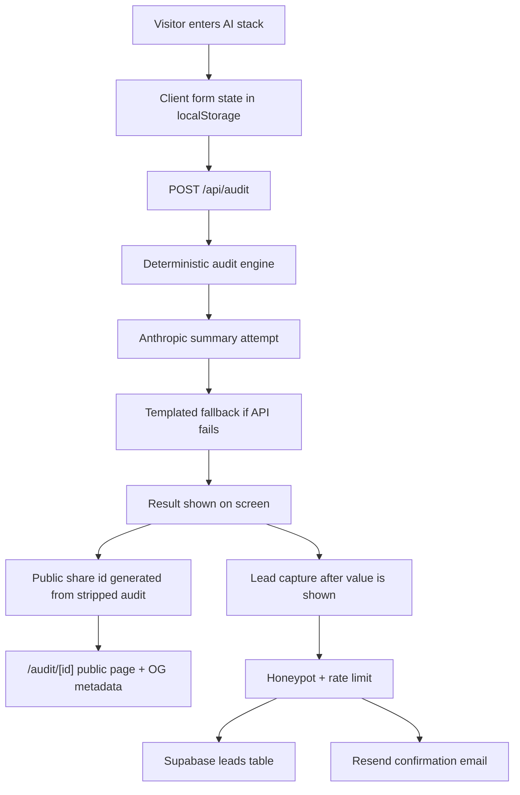

# Architecture

## Data Flow

A visitor enters team size, primary use case, paid tools, plans, monthly spend, and seats. The client persists the form to `localStorage` so a reload does not lose progress. On submit, `/api/audit` validates the payload with Zod and passes it to `runAudit`.

The audit engine uses official pricing data and rule-based recommendations. Each line item compares current spend with a recommended monthly benchmark, records the action, and gives a finance-readable reason. The API then asks Anthropic for a short personalized summary. If the API key is missing, rate-limited, or fails, the app returns a deterministic templated summary.

The share URL encodes only the public audit result: tools, spend, savings, reasons, team size, and use case. Email, company, and role never enter the public URL. Lead capture happens after the audit value is shown and stores the result in Supabase, then sends confirmation through Resend when configured.

## Stack Choice

I chose Next.js, React, and TypeScript because the assignment needs a polished frontend, server-side API routes, dynamic metadata for share pages, and a simple Vercel deployment path. TypeScript keeps the audit engine, form payloads, and API responses aligned. Vitest covers the deterministic audit rules because those are the highest-risk business logic.

## 10k Audits per Day

At 10k audits/day, I would move share results from encoded URLs into a database-backed `audits` table with short slugs, add durable rate limiting through Upstash or Cloudflare Turnstile, queue email sends, and cache OG metadata. I would also add event analytics for audit completion, lead capture, and consultation booking, then review recommendation accuracy weekly against user feedback and Credex close rates.
