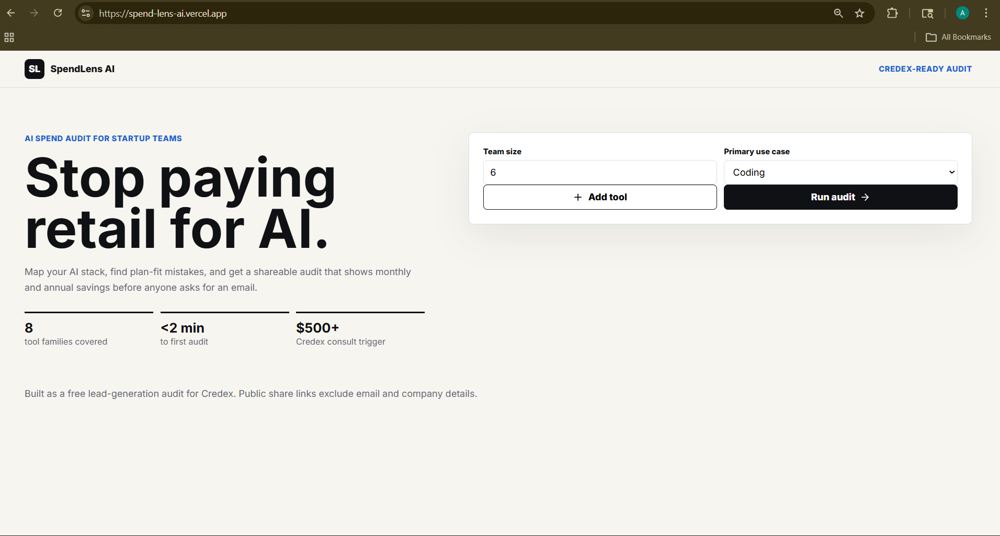
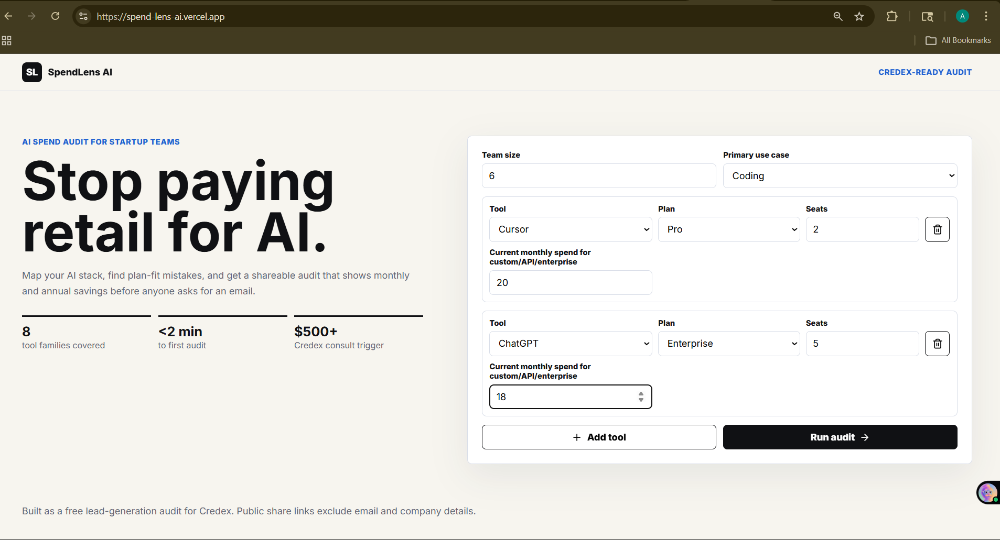
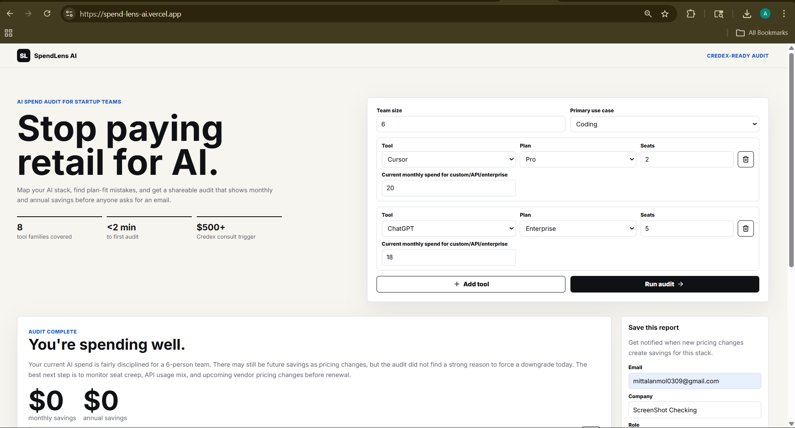
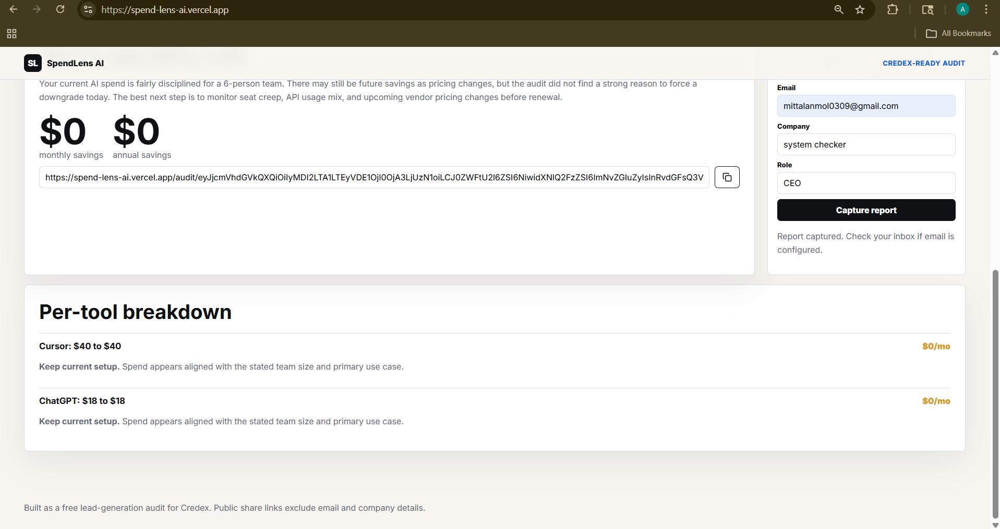
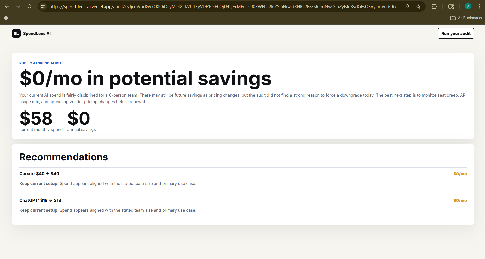

# SpendLens AI

SpendLens AI is a free AI spend audit platform for startup founders, CTOs, engineering managers, and developers who want to understand if they're overspending on AI tools like Cursor, Copilot, ChatGPT, Claude, Gemini, Windsurf, and API usage.

Analyze your AI stack, evaluate plan fit, identify overlapping subscriptions, estimate monthly + annual savings, and get a shareable audit report with personalized recommendations.

---

## Live Demo

https://spend-lens-ai.vercel.app/

---

## Features

| Feature | Description |
|---------|-------------|
| **AI Tool Spend Audit** | Covers 8 tool families: Cursor, Copilot, Claude, ChatGPT, Anthropic API, OpenAI API, Gemini, Windsurf |
| **Deterministic Engine** | Rule-based recommendations — predictable, defensible, no hallucinated pricing |
| **Plan-Fit Analysis** | Detects over-provisioned plans (e.g., Business for <5 seats, Enterprise for small teams) |
| **Savings Estimation** | Monthly + annual savings with high-savings flag (>$500/mo) |
| **AI-Personalized Summary** | OpenRouter free tier (Llama 3.1 8B) for natural-language summaries; falls back to template |
| **Shareable Public Reports** | Clean URLs with no email/company data — safe for viral sharing |
| **Lead Capture + Email** | Resend API sends PDF report attachment + stores lead in Supabase |
| **Local History (IndexedDB)** | Persistent audit history at `/history` — download, open, delete, clear all |
| **Persistent Form State** | Form input survives refresh; audit results persist across navigation (Home ↔ History) |
| **Responsive UI** | Mobile-friendly, light/dark aware, no heavy dependencies |

---

## Screenshots

| Landing | Audit Form | Results |
|---------|------------|---------|
|  |  |  |

| Results (cont.) | Shareable Report |
|-----------------|------------------|
|  |  |

---

## Tech Stack

- **Framework**: Next.js 16 (App Router)
- **Language**: TypeScript (strict)
- **Styling**: Tailwind CSS (CSS variables, no Tailwind config)
- **PDF Generation**: @react-pdf/renderer (client-side `toBlob`, server-side `renderToBuffer`)
- **AI Provider**: OpenRouter (free tier: `meta-llama/llama-3.1-8b-instruct`)
- **Email**: Resend (with PDF attachment as base64)
- **Leads Storage**: Supabase (PostgreSQL)
- **Deployment**: Vercel (preview per branch, production on main)
- **Testing**: Vitest
- **CI**: GitHub Actions (lint + test on push)

---

## Quick Start

```bash
# Clone
git clone https://github.com/Anmol-Mittal30/spendLens-ai
cd spendLens-ai

# Install
npm install

# Configure env (copy .env.example to .env.local and fill values)
cp .env.example .env.local

# Run dev server
npm run dev

# Open http://localhost:3000
```

---

## Environment Variables

| Variable | Required | Description |
|----------|----------|-------------|
| `NEXT_PUBLIC_APP_URL` | Yes | Base URL for share links and email |
| `OPENROUTER_API_KEY` | No | Free at openrouter.ai — enables AI summaries |
| `SUPABASE_URL` | No | For lead storage |
| `SUPABASE_SERVICE_ROLE_KEY` | No | Service role key for server writes |
| `RESEND_API_KEY` | No | For email with PDF attachment |
| `RESEND_FROM_EMAIL` | No | Verified sender (e.g., `SpendLens AI <onboarding@resend.dev>`) |
| `LEAD_TO_EMAIL` | No | Notification email for new leads |

The app works fully offline (deterministic audit + PDF download) without any API keys.

---

## Deployment

Deployed on Vercel:

```bash
# Build locally to verify
npm run build

# Push to main — Vercel auto-deploys
git push origin main
```

Add environment variables in Vercel Dashboard → Settings → Environment Variables (target: **Production**).

---

## Architecture Decisions

1. **Deterministic audit logic** — Pricing recommendations use rules, not LLM, for predictable outputs
2. **AI only for personalization** — LLM generates the summary paragraph; calculations stay rule-based
3. **Public URLs exclude PII** — Shareable reports contain no email/company data
4. **Graceful fallbacks** — Missing API keys → template summary; failed API calls → template summary
5. **Local-first history** — IndexedDB in browser, no server needed for audit history
6. **Client-side PDF** — `pdf().toBlob()` for downloads, no server round-trip

---

## Project Structure

```
app/
  page.tsx              → Main audit form + results
  history/page.tsx      → Local audit history (IndexedDB)
  audit/[id]/page.tsx   → Public shareable report
  api/
    audit/route.ts      → POST: run audit + AI summary
    leads/route.ts      → POST: capture lead + email PDF
lib/
  audit.ts              → Rule engine + templated summaries
  ai-provider.ts        → OpenRouter client + prompt building
  summary.ts            → generateSummary() — AI first, template fallback
  history.ts            → IndexedDB wrapper (save/get/delete/clear)
  pdf-report.tsx        → @react-pdf/renderer component
  lead.tsx              → Server PDF generation + Resend send
  pricing.ts            → Plan prices + tool metadata
  types.ts              → Shared TypeScript types
  share.ts              → Base64 URL encoding for share IDs
tests/
  audit.test.ts         → Vitest unit tests for audit engine
.github/workflows/
  ci.yml                → Lint + test on push
```

---

## Future Improvements

- Benchmark spend comparison across startup stages
- Multi-user workspaces with shared history
- Historical spend tracking over time
- Confidence scoring on recommendations
- Real-time pricing sync from vendor APIs
- Export to Notion/Google Sheets/CSV

---

## License

MIT — free to use, modify, and distribute.